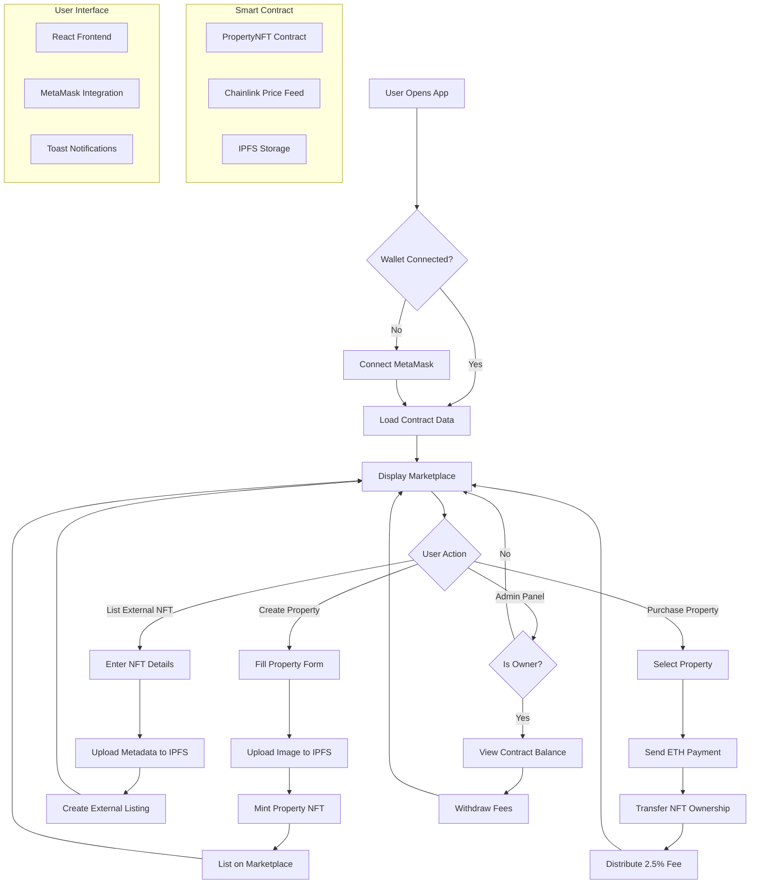

# PropertyNFT Marketplace 🏠🔗

A comprehensive decentralized marketplace for real estate NFTs built on Ethereum, enabling users to mint, list, buy, and sell property-backed NFTs with integrated USD pricing via Chainlink oracles and CCIP.

## 🌟 Features

### Core Functionality
- **Property NFT Minting**: Create unique NFTs representing real estate properties with detailed metadata
- **Dual NFT Support**: Handle both internally minted property NFTs and external NFTs from other contracts
- **Real-time USD Pricing**: Integrated Chainlink price feeds for accurate ETH to USD conversion
- **Decentralized Storage**: IPFS integration via Pinata for secure image and metadata storage
- **Smart Contract Automation**: Automated fee collection and distribution with 2.5% marketplace commission
- **Owner Management**: Administrative functions for contract owners including fee withdrawal

### User Experience
- **Modern Dark UI**: Sleek, responsive interface optimized for Web3 interactions
- **Toast Notifications**: Real-time transaction status updates and user feedback
- **Multi-tab Navigation**: Organized sections for marketplace, creation, listings, and administration
- **Wallet Integration**: Seamless MetaMask connectivity with account management
- **Image Optimization**: Multiple IPFS gateway fallbacks for reliable image loading
- **Mobile Responsive**: Fully optimized for desktop and mobile devices

## 🏗️ Architecture Overview



## 🚀 Getting Started

### Prerequisites
- Node.js (v16 or higher)
- npm or yarn package manager
- MetaMask browser extension
- Ethereum testnet ETH (Sepolia recommended)

### Installation

1. **Clone the repository**
```bash
git clone https://github.com/Aditya-alchemist/RealEstate-Chromium-hackathon
cd frontend
```

2. **Install dependencies**
```bash
npm install
# or
yarn install
```

3. **Configure environment variables**
Create a `.env` file in the root directory:
```env
REACT_APP_CONTRACT_ADDRESS=0x0A47388e92d2c5aFF354CbCCC41fb8f80a0ef9Db
REACT_APP_OWNER_ADDRESS=0x7f21d6db0b059496ee1c0810898e35c125a714ab
REACT_APP_PINATA_API_KEY=your_pinata_api_key
REACT_APP_PINATA_SECRET_KEY=your_pinata_secret_key
```

4. **Start the development server**
```bash
npm start
# or
yarn start
```

5. **Access the application**
Navigate to `http://localhost:3000` in your browser with MetaMask installed.

## 📋 Smart Contract Details

### Contract Address
- **Sepolia Testnet**: `0x0A47388e92d2c5aFF354CbCCC41fb8f80a0ef9Db`
- **Owner Address**: `0x7f21d6db0b059496ee1c0810898e35c125a714ab`

### Key Functions

#### Property Management
- `mintProperty(PropertyParams memory params)`: Creates a new property NFT with metadata
- `purchaseProperty(uint256 tokenId)`: Purchases a listed property NFT
- `getPropertyWithUSDPrice(uint256 tokenId)`: Retrieves property details with current USD pricing

#### External NFT Integration
- `listExternalNFT(ExternalNFTParams memory params)`: Lists external NFTs on the marketplace
- `purchaseExternalNFT(uint256 listingId)`: Purchases listed external NFTs
- `getUserExternalListings(address user)`: Gets user's external NFT listings

#### Administrative Functions
- `withdrawFees()`: Allows contract owner to withdraw collected marketplace fees
- `getListedProperties()`: Returns array of all listed property token IDs
- `getActiveExternalListings()`: Returns array of active external listing IDs

## 🔧 Technology Stack

### Frontend
- **React 18**: Modern JavaScript library for building user interfaces
- **Ethers.js v6**: Ethereum library for blockchain interactions
- **Axios**: HTTP client for API requests to Pinata
- **CSS3**: Custom styling with CSS variables and animations
- **Web3 Modal**: Wallet connection interface

### Blockchain
- **Solidity**: Smart contract programming language
- **Ethereum**: Blockchain platform for decentralized applications
- **Chainlink**: Decentralized oracle network for price feeds
- **OpenZeppelin**: Secure smart contract libraries

### Storage & Infrastructure
- **IPFS**: Distributed file storage system
- **Pinata**: IPFS pinning service for reliable content delivery
- **MetaMask**: Browser-based Ethereum wallet

## 💰 Economic Model

### Fee Structure
- **Marketplace Fee**: 2.5% of each transaction
- **Gas Optimization**: Efficient smart contract design to minimize transaction costs
- **Revenue Distribution**: Fees collected by contract owner, transparently tracked on-chain

### Pricing Mechanism
- **ETH-based Pricing**: All transactions conducted in Ethereum
- **USD Reference**: Real-time USD conversion via Chainlink price feeds
- **Dynamic Updates**: Prices automatically updated with market fluctuations

## 🔐 Security Features

### Smart Contract Security
- **Reentrancy Protection**: Guards against reentrancy attacks
- **Access Control**: Owner-only functions for administrative tasks
- **Input Validation**: Comprehensive parameter checking and validation
- **Safe Math Operations**: Overflow protection for all mathematical operations

### Frontend Security
- **Wallet Validation**: Continuous wallet connection monitoring
- **Transaction Verification**: Multi-step confirmation for all blockchain interactions
- **Error Handling**: Comprehensive error catching and user feedback
- **IPFS Reliability**: Multiple gateway fallbacks for content availability

## 📊 User Flows

### Property Creation Flow
1. **Connect Wallet**: User connects MetaMask to the application
2. **Fill Property Details**: Enter name, address, description, and owner information
3. **Upload Image**: Select and upload property image to IPFS
4. **Set Price**: Define listing price in ETH
5. **Mint NFT**: Execute smart contract transaction to create NFT
6. **Automatic Listing**: Property automatically listed on marketplace

### Purchase Flow
1. **Browse Marketplace**: View available properties with USD pricing
2. **Select Property**: Choose desired property from grid display
3. **Confirm Purchase**: Review property details and pricing
4. **Execute Transaction**: Send ETH payment to smart contract
5. **Transfer Ownership**: NFT automatically transferred to buyer
6. **Fee Distribution**: Marketplace fee sent to contract owner

### External NFT Listing Flow
1. **Verify Ownership**: Confirm ownership of external NFT
2. **Provide Contract Details**: Enter NFT contract address and token ID
3. **Add Metadata**: Include property information and images
4. **Set Listing Price**: Define sale price in ETH
5. **Create Listing**: Execute transaction to list on marketplace
6. **Manage Listing**: Monitor and manage active listings

## 🎨 UI/UX Features

### Design Philosophy
- **Dark Theme**: Modern, eye-friendly dark interface
- **Gradient Accents**: Vibrant blue-purple gradients for visual appeal
- **Responsive Layout**: Optimized for all screen sizes and devices
- **Smooth Animations**: Subtle transitions and hover effects

### Interactive Elements
- **Property Cards**: Hover effects with image scaling and shadow enhancement
- **Toast Notifications**: Real-time feedback for user actions
- **Loading States**: Visual indicators for pending transactions
- **Tab Navigation**: Organized content sections with active state indicators

## 🔮 Future Enhancements

### Planned Features
- **Fractional Ownership**: Enable multiple users to own shares of a single property
- **Rental Marketplace**: Platform for renting property NFTs
- **Advanced Filtering**: Search and filter properties by location, price, and features
- **Mobile App**: Native mobile application for iOS and Android
- **Multi-chain Support**: Expansion to other blockchain networks

### Technical Improvements
- **Layer 2 Integration**: Polygon or Arbitrum support for lower transaction costs
- **Enhanced Oracle Integration**: Multiple price feed sources for increased reliability
- **Advanced Analytics**: Comprehensive marketplace statistics and insights
- **Social Features**: User profiles, reviews, and community features

## 🤝 Contributing

We welcome contributions from the community! Please read our contributing guidelines and submit pull requests for any improvements.

### Development Setup
1. Fork the repository
2. Create a feature branch
3. Make your changes
4. Add tests if applicable
5. Submit a pull request

## 📄 License

This project is licensed under the MIT License - see the [LICENSE](LICENSE) file for details.

## 📞 Support

For support, questions, or feature requests:
- Create an issue on GitHub
- Join our Discord community
- Follow us on Twitter for updates

**Built with ❤️ for the decentralized future of real estate**

